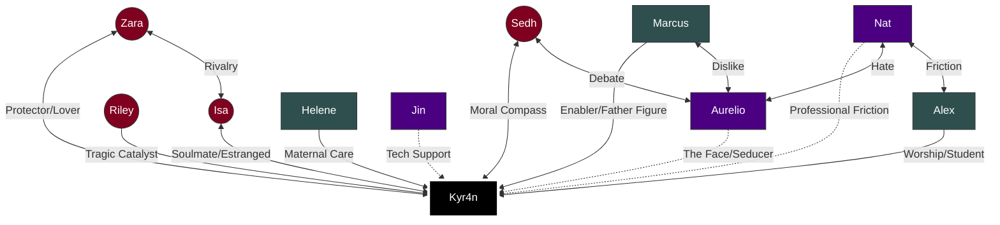

Visualizing a cast this complex requires more than a simple family tree. Because your story relies on **"Complementary Friction"** (how characters clash and balance each other), you need visualization methods that show **influence, distance, and ideology.**

Here are three distinct ways to visualize the relationships of Phoenix Rising, depending on what you need to analyze.

---

### 1. The "Solar System" Map (Proximity to Power)
This visualization places **Kyr4n** at the center (The Sun) and maps characters based on their emotional closeness and their function.

*   **Concept:** The closer to the center, the more "Human/Vulnerable" Kyr4n is with them. The further out, the more "Transactional/Professional" the relationship.
*   **Quadrants:** Divide the map into four zones: **Violence, Logistics, Heart, Info.**

#### The Layout:
*   **Center (The Core):** Kyr4n
*   **Orbit 1 (The Soul - Vulnerability):**
    *   **Sedh:** The Conscience.
    *   **Isa:** The Love/Regret.
    *   **Riley:** The Memory (Ghost).
    *   **Evil Isa:** The Parasite (attached directly to the core).
*   **Orbit 2 (The Hands - Trusted Execution):**
    *   **Marcus:** Security/Father Figure (Violence Quadrant).
    *   **Zara:** Bodyguard/Lover (Violence Quadrant).
    *   **Helene:** Matriarch (Care Quadrant).
    *   **Alex:** Disciple (Violence Quadrant).
*   **Orbit 3 (The Machine - Necessary Tools):**
    *   **Nat:** The Operator (Logistics Quadrant).
    *   **Aurelio:** The Face (Info/Logistics Quadrant).
    *   **Jin:** The Engineer (Logistics Quadrant).
    *   **Mira:** The Healer (Care Quadrant).
*   **Orbit 4 (The Satellites - Independent):**
    *   **Kaia:** Intelligence (Info Quadrant).
    *   **Mat:** The Wildcard (Info Quadrant).
    *   **Frank:** The Debtor (Outsider).

---

### 2. The "Ideological Triangle" (Conflict Map)
This maps characters based on *why* they do what they do. This helps you write scenes where characters argue about **methods**.

*   **Point A: PRAGMATISM (Order/Control)**
    *   *Motto: "Whatever works."*
    *   **Key Players:** Nat, Marcus, Alex.
    *   *Conflict:* They clash with the Idealists.
*   **Point B: IDEALISM (Ethics/Humanity)**
    *   *Motto: "Do no harm."*
    *   **Key Players:** Sedh, Helene, Riley, Isa.
    *   *Conflict:* They clash with the Hedonists/Pragmatists.
*   **Point C: EGO/CHAOS (Power/Truth)**
    *   *Motto: "Because I can."*
    *   **Key Players:** Aurelio, Kaia, Mat, Zara (initially).
    *   *Conflict:* They clash with the Pragmatists (who find them annoying) and Idealists (who find them dangerous).

**Where is Kyr4n?**
*   He floats in the middle, being pulled by all three corners. The tragedy of the story is his drift from **Idealism** toward **Pragmatism**, and finally toward **Ego** (via Evil Isa).

---

### 3. The Mermaid Diagram (Network Graph)
Here is a generated code you can use in Obsidian, Notion, or any Mermaid editor to see the specific links.

---

### 4. The "Conflict Matrix" (Writing Tool)
Use this when writing a scene with multiple characters to remember their specific "flavor" of tension.

| Character A | Character B | **The Dynamic** | **The Vibe** |
| :--- | :--- | :--- | :--- |
| **Nat** | **Aurelio** | **Order vs. Chaos** | Nat trying to do taxes while Aurelio throws a party. Screaming matches. |
| **Marcus** | **Zara** | **Old Guard vs. New Blood** | Grudging respect. They bond over weapons but disagree on risk. |
| **Sedh** | **Alex** | **Ethics vs. Obedience** | Sedh asks "Should we?" Alex asks "How do we?" |
| **Helene** | **Nat** | **People vs. Numbers** | Helene wants to save everyone; Nat wants to save the budget. |
| **Kaia** | **Mat** | **Leverage vs. Truth** | Spy vs. Spy. Professional rivalry with sexual tension (intellectual). |
| **Kyr4n** | **Aurelio** | **The Monster vs. The Fan** | Aurelio encourages Kyr4n's god complex; Kyr4n is amused/disturbed. |

### Recommendation for Your Wall/Notes
If you want a single visual aid while writing:

**Draw the Solar System Map.**
1.  Put **Kyr4n** in the center.
2.  Draw a circle around him labeled **"The Blast Radius"** (People who get hurt when he loses control). Inside this circle put **Zara, Sedh, Marcus, Isa.**
3.  Draw a second circle labeled **"The Machinery"** (People who run the empire). Put **Nat, Aurelio, Alex, Helene** here.
4.  Draw **Aurelio** straddling the line—he wants to be in the Blast Radius, but belongs in the Machinery.
5.  Draw **Nat** firmly in the Machinery, looking tired.