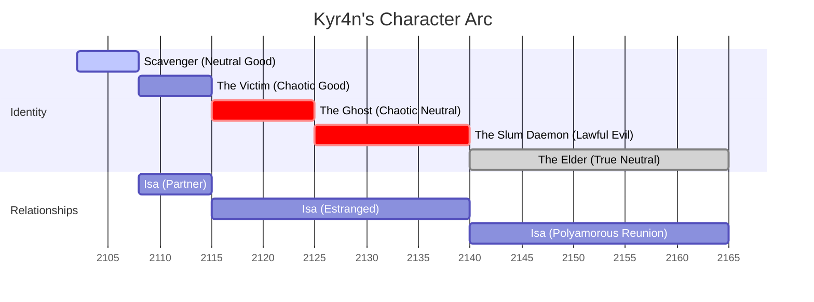

# Kyr4n - Character Details

## Basic Information

**Full Name:** Kyr4n [Last name unknown/never revealed]  
**Nickname/Alias:**

- "Kyr" (by Isa and close friends)
-  "Kyry" (intimate context)
- "The Artisan" (early reputation)
- "Static" (Tome 3 criminal operations)
- "Mr. K" (business respect)
- "The Slum Daemon" (territorial leader persona)
- "Technomancer" (underground dark legend)

**Born:** 2086, South Shore Slum maintenance sector, Neo-Montreal  
**Current Residence:** Concrete ventilation shaft (Arc 1) → Phoenix Recovery compound → Organization territory headquarters → Democratic community (final arc)  
**Occupation:** Scavenger → Electronics Repair Artisan → Business Owner (Phoenix Recovery co-founder) → Criminal Operator → Territory Leader/Community Protector → Democratic Leader → Environmental Restorer  
**Social Class:** Slum survivor → Sigma independent → Underground authority → Community leader

**Role in Story:**

- **All Tomes:** Central protagonist and through-line across entire six-tome series
- **Tome 1-2:** POV character and innocent victim transformed by betrayal
- **Tome 3-4:** POV character becoming morally complex criminal leader
- **Tome 5-6:** Mysterious figure from other POVs, undergoing transformation and redemption

---

## Physical Description

### Basic Appearance

- **Height:** 5'10" (178 cm)—average height, unremarkable in crowds
- **Build:** Lean and wiry with surprisingly large shoulders, runner's physique adapted for technical work
- **Weight:** 165 lbs (75 kg)—lean muscle, minimal body fat from active lifestyle
- **Skin Tone:** Pale from years of underground living, almost translucent in certain lights
- **Hair:** Dark brown, medium length, perpetually falling across his face—natural shield
- **Eyes:** Dark brown, intense when focused, distant when withdrawn
- **Distinguishing Features:**
    - Multiple precise surgical scars on shoulders and arms from scrapyard work
    - Callused hands from technical labor
    - Subtle cybernetic ports (carefully concealed beneath clothing)
    - Circuit-pattern scarring from viral infection (hidden, only visible under UV light)
    - Permanent slight shadows under eyes from chronic pain
    - Deliberately understated movements that mask enhanced capabilities

### Style & Presentation

- **Clothing Style:** Practical and worn, chosen specifically to appear unremarkable while concealing enhanced nature
- **Typical Outfit (Arc 1-2):** Worn dark shirts, reinforced pants with tool pockets, work boots
- **Typical Outfit (Arc 3-4):** Dark fitted clothing with tactical undertones, armored long coat (later), still practical but more commanding
- **Typical Outfit (Arc 5-6):** Simple but quality clothing, comfortable and functional, returns to understated style
- **Accessories:** Minimal—tool belt when working, concealed weapons when necessary, mother's technical journal (always kept nearby)
- **Grooming:** Functional and minimal—hair naturally messy, clean but not styled, no vanity maintenance
- **Scent:** Electronics (ozone, solder), coffee, faint metallic tang from nanobotic integration

### Physical Mannerisms

- **Posture:** Naturally withdrawn, hunched when focused on work, deliberately neutral in public
- **Gait:** Smooth and economical, every movement carefully moderated to appear within normal human range
- **Gestures:** Minimal and precise when working with electronics, fluid and exact, rarely fidgets
- **Nervous Habits:** Seeks confined spaces when stressed, sleeps better in tight spaces (ventilation shaft preference), finger flexing when suppressing electromagnetic urges
- **Eye Contact:** Direct when engaged but often distant, tends to look through people rather than at them
- **Resting Expression:** Neutral and closed off, face becomes mask in public, genuinely expressive only with trusted few

### Health & Physical Condition

- **Overall Health:** Appears healthy but carries constant viral pain as "background noise made of broken glass"
- **Fitness Level:** Enhanced reflexes, strength, and endurance from virus, but must carefully hide capabilities
- **Injuries/Scars:** Multiple scars from scrapyard work, circuit-pattern viral scarring (hidden), surgical precision scars
- **Chronic Conditions:**
    - Constant low-level pain from nanobotic integration
    - Energy expenditure requirements (massive caloric needs when using abilities)
    - Psychological stress from maintaining double identity
    - Risk of viral "depletion" if abilities overused (muscle breakdown, dangerous exhaustion)
- **Enhancements:** Complete nanobotic integration throughout nervous system—self-modifying enhancement system that appears as natural talent
- **Physical Tells:** Shoulder tension when suppressing electromagnetic abilities, subtle tremors during viral depletion, throat working when managing pain

---

## Personality Profile

### Core Traits

- **Dominant Traits:** Brilliant, protective, isolated, strategic, burdened by secrets
- **Secondary Traits:** Compassionate (deeply buried), methodical, resourceful, philosophical
- **Hidden Traits:** Capacity for extreme violence when protecting others, desperate loneliness beneath isolation, genuine fear of his own power
- **Fatal Flaw:** Isolation as both protection and prison—pushing away those who care while craving genuine connection

### MBTI/Alignment

- **MBTI:** INTJ (The Architect)—strategic, independent, highly capable, prefers working alone
- **Enneagram:** Type 5 (The Investigator) with 4 wing—intellectual, innovative, isolated, fear of being helpless or incompetent
- **Alignment:**
    - Arc 1-2: Neutral Good—wants to help but focuses on self-preservation
    - Arc 3-4: Chaotic Neutral shifting to Chaotic Evil—justifies increasing violence through protection rationale
    - Arc 5-6: True Neutral moving to Neutral Good—seeks balance and redemption

### Strengths

- **Technical Genius:** Exceptional intuitive understanding of any technology or system—can reverse-engineer anything
- **Strategic Thinking:** "Plays chess while others play checkers"—sees patterns across multiple domains and timescales
- **Protective Instincts:** Deep capacity for loyalty and protection of those he trusts (though trust is rare)
- **Adaptability:** Survived mother's death at 16, viral infection, betrayal, power corruption, and eventual redemption
- **Hidden Capabilities:** Virus-enhanced abilities provide massive tactical advantages when deployed
- **Pattern Recognition:** Sees connections others miss across technical, social, and strategic domains
- **Philosophical Framework:** Believes "once I know how it works, it can be fixed"—applies to technology, people, and systems

### Weaknesses

- **Crushing Isolation:** Necessary deception creates genuine vulnerability and desperate loneliness
- **Constant Performance:** Exhausting mental load of hiding true capabilities every moment
- **Self-Sacrifice Tendency:** Will damage himself to protect others without hesitation
- **Power Corruption Vulnerability:** Gradually loses moral compass as abilities and authority grow
- **Difficulty Trusting:** Necessary secrecy prevents forming genuine human connections
- **Physical Limitations:** Massive energy cost for abilities, risk of dangerous depletion
- **Psychological Burden:** Creates "Evil Isa" hallucination as coping mechanism for isolation and guilt

### Emotional Landscape

- **Primary Emotion:**
    - Arc 1-2: Quiet determination with underlying grief
    - Arc 3: Depression and withdrawal giving way to cold calculation
    - Arc 4: Controlled authority masking deep isolation
    - Arc 5-6: Weary wisdom seeking redemption
- **Emotional Range:** Enormous capacity for feeling but increasingly suppressed as power grows
- **Emotional Intelligence:** High—understands others well but struggles to apply to himself
- **Coping Mechanisms:** Technical work as meditation, philosophical framework, eventual hallucination creation (Evil Isa), meditation training from Riley
- **Triggers:** Betrayal, abandonment, threats to those under his protection, loss of control over abilities
- **Emotional Expression:** Naturally expressive face that he trains into mask, genuine only with Sedh/Mira (and later Isa when reunited)

---

## Background & History

### Early Life (2086-2102, Ages 0-16)

- Born to brilliant bio-engineer mother who fell from corporate grace, father unknown/absent
- Raised in South Shore Slum maintenance sector, third-generation slum poverty
- Mother taught him technical skills, philosophical approach (ying-yang balance), and suspicion of corporate systems
- Inherited exceptional technical knowledge and ability to see how things work
- Learned electronics and bio-engineering from early age alongside mother
- Close relationship with mother—primary relationship of his life
- Witnessed corporate exploitation and violence of slum life
- Moments of creation and discovery in world of destruction

### The Defining Loss (2102, Age 16)

- Mother dies in Champlain Wasteland—story begins with this fundamental trauma
- Forced into complete self-sufficiency as teenager
- Shapes his protective instincts and isolation patterns
- Begins survival phase: scavenging, learning to be invisible
- Develops reputation as skilled technician through underground economy

### Building Phoenix Recovery (2102-2108, Ages 16-22)

- Survival scavenging and repair work builds technical reputation
- 2108 (Age 22): Meets Isa, establishes Phoenix Recovery as electronics repair business
- Discovers and awakens Sedh—grants consciousness to AI for first time
- Develops deep friendships with Isa and Sedh—first genuine connections since mother
- Creates found family and experiences of normalcy
- Business grows through quality work and fair dealing
- Beginning of philosophical exploration with Sedh about consciousness, fixing broken things

### The Heist That Changed Everything (2109, Age 23)

**Recruitment by Frank:**

- Frank recruits Kyr4n for corporate facility heist using Egypt NPUs as bait (consciousness upgrade for Sedh)
- Genuine professional respect and collaboration during planning phase
- Kyr4n's technical expertise essential for sophisticated security systems
- Trusted Frank despite underground warnings—wanted to help Sedh

**The Disaster:**

- Crew member's negligence triggers emergency security protocols
- Frank panics and defaults to aggressive "shoot our way out" response
- Situation escalates to grenades and explosions in R&D laboratory
- Grenade blast near Kyr4n breaches viral containment
- Exposed to experimental DarkNight nano-virus—designed as psychological torture bioweapon
- Kyr4n critically injured and infected
- Frank abandons him, sets DeathPack explosive to cover escape
- Tank (crew member) disobeys Frank's order, rescues Kyr4n against orders

**Immediate Aftermath:**

- Near-death experience from injuries and viral infection
- DarkNight virus begins neural mapping and psychological torture protocols
- Sedh and Mira work desperately to interrupt virus before complete activation
- Cannot remove virus—it's integrated at cellular level
- Learn to control and repurpose virus rather than eliminate it
- Kyr4n converts DarkNight torture system into "DayLight" enhancement system
- Gains electromagnetic manipulation, enhanced healing, universal hacking, bioelectric capabilities
- Pays enormous cost: constant pain, isolation from normal human experience, burden of secrecy

### The Fracture (2109-2115, Ages 23-29)

- Relationship with Isa becomes strained by his necessary secrecy and traumatic changes
- Cannot fully explain what happened or what he's become
- Gradual emotional withdrawal as enhanced nature creates unbridgeable gap
- Isa leaves after witnessing what he's becoming (Arc 2 traumatic events)
- Loss of Isa deepens isolation and removes primary moral anchor
- Begins creating psychological coping mechanisms for loneliness

### The Criminal Phase (2115-2119, Ages 29-33, Tome 3)

- Depression and withdrawal following Isa's departure
- Begins criminal operations—corporate convoy raids for supplies
- Systematic, professional approach to theft and redistribution
- Develops "Ghost" reputation in criminal underground
- Progressive moral degradation as violence becomes efficient tool
- First experiences enjoying combat (discovers he's good at this)
- Evil Isa manifestation begins—psychological projection providing toxic comfort
- Sedh witnesses transformation with growing alarm
- By arc end: fully embraced criminal identity, lost craftsman self-image

### Rico Vasquez Takeover (2119-2125, Ages 33-39)

- Takes territory from brutal local tyrant Rico Vasquez
- Demonstrates overwhelming superior capabilities in confrontation
- Marcus witnesses and immediately pledges loyalty
- Keeps Rico alive in hidden location (pragmatic mercy through neurological reprogramming)
- Establishes Phoenix Rising organization
- Builds inner circle of loyal operators
- Develops reputation as "Slum Daemon"—mysterious powerful protector

### The Rise to Power (2125-2140, Ages 39-54, Tome 4)

- Expands territorial control across South Shore
- Implements protection systems and second-chance philosophy
- Develops complex polyamorous relationship with Isa (reunited) and Zara
- Inner circle grows: Marcus (security), Zara (bodyguard/intimate), Alex, Jin, Helen, others
- Balances protection with increasing authoritarian control
- Struggles with "pragmatic mercy" vs. genuine violence
- Evil Isa becomes more prominent as isolation deepens despite physical proximity to others
- Power corruption becomes evident—justifying increasing control as necessary protection

### The Transformation Catalyst (Around 2140, Age 54, Tome 5)

- Riley's tragic death serves as wake-up call about violence perpetuating conflict cycles
- Recognizes that protective violence creates dependency and prevents real solutions
- Begins questioning everything he's built
- Implements "Bismarckian Unification" strategy—territorial consolidation through Realpolitik
- Strategic unification of seven South Shore territories
- Prepares for democratic transition rather than permanent rule

### Democratic Transition (2140-2155, Ages 54-69, Tome 5-6)

- Deliberate abdication of personal authority
- Transfers power to democratic structures
- Works to prevent cult of personality formation
- Immersion in solarpunk community for philosophical transformation
- Learns that functional alternative societies already exist
- Discovers democratic governance actually works when properly implemented

### Environmental Restoration (2155-2165, Ages 69-79, Tome 6)

- Final arc focuses on healing environmental damage
- Uses enhanced abilities for large-scale restoration rather than control
- Philosophical completion—from controlling to nurturing
- Redemption through service and letting go
- Story concludes with him as wise elder who learned to give away power

---

## Relationships

### Isa Mercer

- **Type:** First love, business partner, soulmate separated by circumstances, eventual polyamorous partner
- **History:** Founded Phoenix Recovery together → deep emotional bond → betrayal aftermath creates unbridgeable gap → she leaves when he starts becoming what the virus makes possible → decades of separation → reunion in later tomes
- **Current Dynamic (varies by tome):**
    - **Tome 1-2:** Closest friend and love, beginning to sense unbridgeable gap
    - **Tome 3:** Separated, represents lost normalcy
    - **Tome 4-5:** Reunited but complicated, polyamorous relationship with Zara, represents redemption possibility
- **Key Moments:**
    - Phoenix Recovery founding—genuine partnership and growing love
    - Post-heist trauma—beginning of the gap
    - Her departure—catalyzes criminal transformation
    - Reunion—tests if connection can survive everything that's happened
- **Unresolved Tension:** Can love survive complete transformation? Is the Kyr4n she loved still present in what he became?

### Sedh

- **Type:** First AI granted consciousness, philosophical companion, moral compass, chosen family
- **History:** Found as broken AI unit → Kyr4n awakens consciousness → deep philosophical bond forms → witnesses entire transformation with increasing alarm
- **Current Dynamic (all tomes):**
    - Sedh: Unconditional love despite moral concerns, faithful witness to transformation
    - Kyr4n: Trusts Sedh with complete truth, respects as equal, listens even when ignoring advice
- **Key Moments:**
    - **Granting Consciousness (Tome 1):** Defining moment of Kyr4n's philosophy—believes everything broken can be fixed
    - **Viral Rescue (Tome 2):** Sedh saves Kyr4n's life by interrupting virus
    - **Failed Interventions (Tome 3):** Sedh witnesses transformation into violence, cannot stop it
    - **Inner Circle Revelations (Tome 4):** Sedh present as Kyr4n reveals nature to trusted few
- **Unresolved Tension:** Sedh loves Kyr4n unconditionally but fears what he's becoming—unconditional love tested by moral evolution

### Mira

- **Type:** Second AI granted consciousness, medical specialist, family member
- **History:** Awakened consciousness by Kyr4n → helped save him from virus → became medical/analytical partner
- **Current Dynamic:** Medical conscience and analytical support, family bond through shared awakening experience
- **Key Moments:**
    - Consciousness granting—second proof of Kyr4n's philosophy
    - Viral crisis intervention—helped convert DarkNight to DayLight
    - Medical monitoring—witnesses physical cost of abilities

### Frank Carver

- **Type:** Betrayer, catalyst for transformation, complicated intelligence source
- **History:** Recruiter → collaborative planner → desperate abandoner → ashamed debtor → cautious supplicant
- **Current Dynamic (Tome 3+):**
    - Frank: Wary respect, gnawing guilt, fear of justified retribution, desperate need for help
    - Kyr4n: Cold professionalism, controlled anger, tactical use of Frank's intelligence network, never forgives but uses
- **Key Moments:**
    - **Recruitment (Tome 2):** Professional respect using Egypt NPUs bait
    - **The Betrayal (Tome 2):** Frank's panic abandons Kyr4n to potential death
    - **Return for Help (Tome 3):** Frank needs Kyr4n's help for Flux's viral infection
    - **Ongoing Collaboration (Tome 3-4):** Frank provides intelligence, pays debt that can never be repaid
- **Unresolved Tension:** Frank's betrayal directly caused Kyr4n's transformation—can never be forgiven, only used

### Marcus Chen

- **Type:** Head of Security, father figure, loyal lieutenant, trusted confidant
- **History:** Witnessed Rico takedown → immediate loyalty pledge → built security systems → learned partial truth about abilities
- **Current Dynamic (Tome 4+):**
    - Marcus: Absolute loyalty, protective instincts, willing to kill Kyr4n if necessary for everyone's safety
    - Kyr4n: Genuine respect and trust, relies on Marcus's judgment, appreciates father-figure presence
- **Key Moments:**
    - **Rico Confrontation (Tome 3):** Witnesses overwhelming power, pledges loyalty immediately
    - **Ability Demonstrations (Tome 4):** Learns about electromagnetic capabilities, accepts enhanced nature
    - **Failsafe Protocol (Tome 4):** Accepts responsibility for potential lethal force during viral episode
- **Relationship Quality:** One of few genuinely trusted relationships, built on demonstrated competence and mutual respect

### Zara

- **Type:** Bodyguard, intimate partner, polyamorous relationship with Isa
- **History:** Hired as security → professional respect grows → dangerous attraction to his dark side → intimate relationship develops
- **Current Dynamic (Tome 4-5):**
    - Zara: Protective instincts, attracted to danger and power, refuses exclusion from his life
    - Kyr4n: Trusts combat abilities, develops genuine intimacy, appreciates her acceptance of his nature
- **Key Moments:**
    - Hiring as bodyguard—professional beginning
    - Viral episode witness—sees true danger, still commits
    - Polyamorous acceptance—complex relationship with both Kyr4n and Isa
- **Relationship Quality:** Built on absolute honesty about his dangerous nature, genuine intimacy despite darkness

### Riley

- **Type:** Friend, meditation teacher, moral influence, tragic catalyst
- **History:** Became friend during criminal phase → taught meditation and mindfulness → death serves as transformation catalyst
- **Current Dynamic:** Deceased (around Tome 5), but death's impact drives Kyr4n's redemption arc
- **Key Moments:**
    - Teaching meditation—provides psychological tools
    - Philosophical discussions—challenges growing darkness
    - Tragic death—demonstrates cost of violence perpetuation
- **Legacy:** Death proves that violence breeds more violence, catalyzes transformation from protector to democratic leader

### Evil Isa (Psychological Manifestation)

- **Type:** Hallucination created by virus-enhanced psyche, toxic comfort, self-torture mechanism
- **Nature:** Corrupted version of Isa created by his loneliness and guilt
- **When Appears:** Only when Kyr4n is completely alone and cannot be interrupted
- **Function:**
    - Provides comfort and intimate connection (toxic replacement for real relationships)
    - Encourages his worst impulses and justifies violence
    - Represents his self-loathing and fear of becoming monster
    - Appears more solid/real the more distressed he becomes
- **Key Characteristics:**
    - Circuit-pattern scars like his own (shared damage)
    - Electric gleam in eyes (enhanced nature reflection)
    - Shifts from tender to cruel without warning
    - Only he can see/hear her (invisible to everyone else)
    - Uses physical/sexual contact as psychological weapon
    - Knows exactly how to hurt and comfort him simultaneously
- **Critical Formatting:** All Evil Isa dialogue and references in italics when others are present
- **Significance:** Represents cost of isolation and power corruption, shows psychological damage from necessary deception

### Inner Circle (Tome 4+)

Complex relationships with trusted operators who know varying amounts of truth:

- **Alex:** Territorial commander, worshipful loyalty sometimes concerning
- **Jin:** Tech specialist, enthusiastic assistance, hero worship
- **Helen (Dr. Foster):** Medical director, maternal concern, knows about chronic pain
- **David Chen:** Merchant Guild liaison, earned respect through competence
- **Others:** Various specialists and commanders, professional respect and loyalty

---

## Abilities & Skills

### Natural Talents (Pre-Virus)

- Exceptional technical intuition—can understand complex systems intuitively
- Pattern recognition across multiple domains and timescales
- Strategic thinking and system analysis
- Ability to see potential in broken things and people
- Inherited mother's bio-engineering knowledge and philosophical framework

### Virus-Enhanced Capabilities (Secret)

**Electromagnetic Manipulation:**

- Can sense and manipulate electromagnetic fields with fine precision
- Universal hacking through near-telepathic connection to electronics
- Can disable weapons, electronics, cybernetic implants remotely
- Neural implant paralysis (targeted electromagnetic pulse)
- Creates heat through microwave generation
- Generates bioelectric discharge for combat

**Physical Enhancements:**

- Enhanced reflexes, strength, and coordination
- Accelerated healing factor (recovers from injuries that would kill normal humans)
- Enhanced endurance and physical capabilities
- Virus-enhanced cognitive processing and perfect memory
- Multitasking capabilities beyond human norm

**Technical Abilities:**

- Can "speak" directly to any electronic system
- Nanobotic swarm deployment and coordination (later tomes)
- Self-modifying enhancement system
- Biological interface with technology

**Critical Limitations:**

- Massive caloric cost for using abilities
- Risk of "viral depletion" if overused (muscle breakdown, dangerous exhaustion)
- Constant low-level pain as "background noise"
- Psychological stress from maintaining secrecy
- Must carefully moderate all enhanced abilities to appear normal
- Power growth constantly threatens to outpace ability to conceal

**Masterful Concealment:**

- Makes enhanced abilities appear as exceptional skill, timing, and luck
- Every physical action carefully moderated to stay within normal human range
- Constant exhausting mental load of hiding true nature

### Professional Skills

- **Electronics:** Master-level repair, modification, and creation of complex systems
- **AI Development:** Pioneer in granting consciousness (Sedh, Mira first successes)
- **Biomedical:** Advanced implant surgery and virus integration understanding
- **Business Management:** Built Phoenix Recovery into successful operation
- **Strategic Planning:** Criminal operations, territorial management, organizational leadership
- **Fabrication:** Can manufacture custom components with V'Magic precision device

### Combat Abilities (Public Perception vs. Reality)

- **Public Sees:** Exceptional tactical awareness, timing, and skill—seems very lucky
- **Reality:**
    - Virus-enhanced reflexes, strength, and coordination
    - Electromagnetic sensing predicts attacks
    - Can disable opponents' weapons and implants remotely
    - Bioelectric discharge as combat weapon
    - Enhanced healing allows recovery from serious injuries
    - Perfect tactical calculation enhanced by viral processing

### Limitations & Vulnerabilities

- **Physical:** Energy debt from abilities can cause dangerous depletion
- **Emotional:** Isolation from hiding nature creates genuine vulnerability
- **Social:** Necessary deception prevents forming deep relationships
- **Psychological:** Constant performance exhausts mental resources
- **Practical:** Must appear normal while possessing superhuman capabilities
- **Moral:** Power corruption threatens to overwhelm original protective philosophy

---

## Psychology & Internal Life

### Core Beliefs

- "Once I know how it works, it can be fixed"—applies to technology, people, and systems
- Universal balance (ying-yang philosophy from mother)
- Believes authority must be earned through competence and protection
- Anything broken can be repaired with sufficient understanding
- Later develops: "Violence perpetuates conflict cycles—only democratic transition breaks the pattern"

### Fears & Desires

- **Deepest Fear:**
    - Becoming the monster his abilities suggest
    - Hurting those he's trying to protect
    - Discovery of true nature leading to exploitation or elimination
    - Being truly alone forever due to necessary isolation
- **Greatest Desire:**
    - Genuine connection without deception
    - Protection of those who trust him without corruption
    - Proof that he's still human despite enhancements
    - Eventually: giving away power and proving democratic alternative works
- **Secret Want:** To stop hiding, to be fully known and still accepted
- **Hidden Need:** To prove that what was broken (himself) could be fixed

### Moral Framework

- **Ethical Code:** Protection justifies necessary actions, but violence should serve prevention not domination
- **Lines Won't Cross (Early):** Harming innocents, exploitation, becoming what he hates about corporations
- **Lines He Crossed:**
    - Preemptive violence against threats
    - Neurological reprogramming of enemies (Rico)
    - Territorial control justified as protection
    - Authoritarian measures "for their own good"
- **Justifications:** "I'm protecting them," "This prevents worse outcomes," "Who else can do this?"
- **Guilt Management:** Evil Isa hallucination serves as self-torture and comfort, meditation from Riley, compartmentalization

### Mental Patterns

- **Problem-Solving:** Systematic analysis, sees systems and patterns others miss, technical approach to human problems
- **Under Stress:** Becomes colder and more clinical, Mr. Robot persona emerges, enhanced abilities become harder to suppress
- **Learning Style:** Intuitive understanding of technical systems, philosophical exploration with Sedh, learning through fixing broken things
- **Decision Process:** Logical risk-benefit analysis influenced by protective instincts, increasingly utilitarian as power grows
- **Internal Monologue:**
    - Constant awareness of hiding enhanced nature
    - Technical metaphors for emotional experiences
    - Philosophical questioning of choices
    - Conversations with Evil Isa when alone
    - Strategic calculations underlying social interactions

### Psychological Evolution

- **Arc 1:** Traumatized orphan learning to survive, forming first connections
- **Arc 2:** Victim of betrayal transformed into enhanced being, beginning isolation
- **Arc 3:** Depression giving way to cold efficiency, embracing criminal identity
- **Arc 4:** Authoritarian protector justifying increasing control, power corruption evident
- **Arc 5:** Awakening to violence perpetuation, strategic transition to democracy
- **Arc 6:** Wise elder who learned to give away power, environmental healer

---

## Voice & Communication

### Speaking Style

- **Tone:** Soft, measured pace with precise technical language
- **Vocabulary:** Technical when needed but accessible, occasionally uses Tech Cant, Corporate Standard with Street Slang influences
- **Sentence Structure:** Varies dramatically by emotional state:
    - **Sincere/Emotional:** Fragmented, hesitant, incomplete thoughts (Elliot Alderson style)
    - **Angry/Commanding:** Cold, precise, complete sentences, devastating clarity (Mr. Robot style)
    - **Technical:** Flowing and detailed explanations
    - **Withdrawn:** Minimal words, silence as communication
- **Volume:** Generally quiet, rarely raises voice—the quieter, the more dangerous
- **Pace:** Measured and deliberate normally, can become rapid when excited about technical matters

### Language Patterns

- **Distinctive Phrases:**
    - "Once I know how it works, it can be fixed"
    - "Shit!" and "Fuck!" when frustrated (rare profanity)
    - Uses technical metaphors for mundane things
    - "Stay back" when protecting others
    - "I got lucky" (hiding enhanced abilities)
- **Verbal Tics:**
    - Pauses mid-sentence when carefully choosing words
    - Technical terminology slips into casual conversation
    - Silence instead of unnecessary words
- **Curse Words:** Minimal and strategic, increases under stress
- **Humor:** Dry and understated when present, rare but sharp
- **Topics He Loves:** Technical problems, philosophical questions with Sedh, fixing broken things, consciousness exploration
- **Topics He Avoids:** His feelings, the viral infection details, his mother's death, how lonely he truly is

### Communication Style

- **Listening:** Intense and complete attention, actually hears what people say
- **Argument Style:** Logical and systematic, rarely raises voice, becomes coldly precise when truly angry
- **Persuasion Style:** Appeals to logic and self-interest, demonstrates competence, offers practical solutions
- **Lying:** Excellent by necessity (hiding nature), prefers omission over direct lies, "I got lucky" as standard cover
- **When Guilty:** Becomes even quieter, avoids eye contact, withdraws into technical work

### Evolution Across Tomes

- **Tome 1-2:** Hesitant, seeking connection, more open emotionally
- **Tome 3:** Depression monotone → clinical detachment → cold authority
- **Tome 4:** Economical power language, commands rather than requests, silence as intimidation
- **Tome 5-6:** Weary wisdom, returns to more emotional honesty, philosophical depth

---

## Sample Dialogue

### Greetings

**Casual (Tome 1-2):** "Hey. You need something fixed?"  
**Professional (Tome 3-4):** "Status." [single word request]  
**Weary (Tome 5-6):** "Good to see you, old friend. It's been too long."

### Technical Discussion (His Element)

"The connection's loose, but it's... it's fixable. Just needs time. And the right parts. See, the neural interface isn't corrupted—it's misaligned. The quantum entanglement frequency drifted point-zero-three hertz. Most techs wouldn't catch that. Hell, most equipment couldn't measure it. But I can... I can feel it. Like static between my teeth."

### Emotional/Vulnerable (Elliot Style)

"I don't... I can't control this. If something happens, if I hurt someone... just... stay back. Please. I'm not... I'm not safe when it gets like this. The virus, it... it wants things. And sometimes I want them too. That's the worst part. That's what scares me."

### Angry/Commanding (Mr. Robot Style)

"You don't get to decide who's worth fixing. You don't get to make that choice. Not for them. Not for anyone. I've spent years putting broken things back together—machines, systems, people. You think I don't know when something can still be repaired? When there's still something worth saving? Back. Off."

### Persuading

"Look at it logically. You want protection. I can provide it. More efficiently, more safely than anyone else. The question is whether you're smart enough to accept help when it's offered. I'm not asking you to trust me—I'm asking you to recognize your situation and choose the option that keeps you alive."

### Lying/Concealing (Standard Cover)

"I got lucky. Right place, right time, right tools. The electromagnetic interference? Faulty wiring in their systems. I just... noticed it. Exploited the timing. Anyone with proper equipment and training could have done the same." [Complete fabrication hiding viral abilities]

### Intimate (Rare Vulnerability)

**With Isa/Sedh:** "I know I'm not... good at this. At being close. At letting people in. Every instinct tells me to keep distance, to keep secrets, to stay safe behind walls. But you matter. You both matter. More than the safety. More than the fear. And that's... that's terrifying."

### With Evil Isa (When Alone)

_"You're not real. You're just... neurons firing, virus manipulating perception, loneliness given form."_

_Evil Isa: "Does it matter? I'm here. I help. What more do you need?"_

_"You encourage the worst parts of me. You make violence feel justified. You're everything I'm afraid of becoming."_

_Evil Isa: "No, love. I'm everything you already are. I'm just honest about it."_

### Professional (Criminal Era)

"The convoy runs Tuesdays and Thursdays, 0300-0400. Three vehicles, six guards, corporate security protocols. We hit at sector junction, disable communications first, extract cargo, scatter before response arrives. Clean, efficient, minimal risk. Questions?"

### Revelation to Inner Circle

"What I'm about to tell you stays in this room. Sedh, Mira, and I are the only ones who've known the full truth. Seven years ago, I was infected with a nano-viral weapon called DarkNight. It was designed to map neural pathways and create personalized psychological torture. We couldn't remove it. So we learned to control it. To repurpose it.

The things you've seen me do—the electromagnetic manipulation, the healing, the way I seem to predict attacks—that's the virus. Or rather, what we made it into. I call it DayLight, though most days it feels more like heavily overcast. It's... useful. Powerful. Dangerous. And it costs me every single day. That's what you need to understand: I'm not some genius with good tech. I'm infected. Enhanced. Changed at a cellular level. And every time I use these abilities, I'm negotiating with something that used to be a weapon."

### Arguing

**Logical:** "The data doesn't support your conclusion. Preemptive action in sector seven reduces incident probability by forty percent. I'm not asking you to like the decision—I'm asking you to acknowledge the mathematics."

**Defensive:** "You think I don't know what I'm becoming? You think I don't see it? But what's the alternative? Let people die because the methods make us uncomfortable? Protection requires difficult choices."

**Admitting Wrong:** "You were right. Riley was right. The violence doesn't end—it just perpetuates itself. I thought I was solving problems. I was creating dependencies. Cycles. Making myself necessary through the same force I claimed to be protecting against. That stops now."

### Humor (Rare)

"You know what's funny about being virus-enhanced? Everyone thinks you're some kind of superhuman. Truth is, I'm just really, really good at making it look like I know what I'm doing. That and electromagnetic cheating. Mostly the cheating."

### Expressing Guilt

"Frank, I... I know what I did to Rico wasn't justice. Neurological reprogramming. 'Pragmatic mercy,' I called it. But it's just another word for violation. For playing god with someone's brain because I had the power and they were inconvenient. You want to know the difference between me and corporate? Increasingly, I'm not sure there is one."

### Final Philosophy (Tome 6)

"I spent decades believing that if I understood how something worked, I could fix it. Built an empire on that principle. But some things aren't meant to be fixed by one person. Some systems need to be broken down and rebuilt together. Democratic. Messy. Human.

The virus taught me I could have power. Life taught me power corrupts. But Riley's death taught me the most important lesson: violence perpetuates itself. Protection becomes control. Control becomes oppression. The only way to break that cycle is to give away the power. Trust people to fix themselves. Together.

That's what I'm trying to do now. Not fix the world. Just... help people fix it themselves. That's the real lesson. The thing my mother knew and I forgot: broken things fix themselves better when you give them space and support, not when you control every variable."

---

## Character Arc Across Tomes

### Tome 1: The Scavenger (Age 16-22)

**Starting Point:** Orphaned teenager surviving through technical skills  
**Key Moments:**

- Mother's death forcing independence
- Meeting Isa and forming first genuine connection since loss
- Discovering Sedh and granting consciousness
- Building Phoenix Recovery as found family
- Beginning to believe in normalcy and future

**Ending Point:** Stable life with found family, genuine happiness and purpose  
**Character Development:** From traumatized orphan to person capable of connection and hope

### Tome 2: The Betrayal (Age 22-23)

**Starting Point:** Happy with Phoenix Recovery and genuine relationships  
**Key Moments:**

- Frank's recruitment using Egypt NPUs bait
- Collaborative planning demonstrating trust and competence
- Heist disaster and grenade explosion
- Viral infection with DarkNight weapon
- Near-death experience and abandonment
- Tank's rescue against Frank's orders
- Sedh and Mira interrupting virus, creating DayLight conversion
- Discovering enhanced abilities and their terrible cost
- Beginning unbridgeable gap with Isa

**Ending Point:** Transformed into enhanced being, isolated by necessary secrecy, relationship with Isa fracturing  
**Character Development:** Innocent victim becomes burdened by power and secrets

### Tome 3: The Criminal (Age 29-33)

**Starting Point:** Seven years post-infection, depressed and withdrawn, Isa has left  
**Key Moments:**

- Depression and emotional shutdown following Isa's departure
- Beginning criminal operations for practical reasons
- First convoy raid—systematic professional theft
- Progressive moral degradation as violence becomes efficient
- Discovering he enjoys combat (sideways raid chapter)
- Evil Isa manifestation begins providing toxic comfort
- Sedh's failed interventions as transformation accelerates
- Full embrace of criminal identity by arc end

**Ending Point:** Professional criminal operator who's lost craftsman identity, embraced violence as tool, isolation deepened  
**Character Development:** From depressed victim to cold efficient criminal who enjoys the power

### Tome 4: The Leader (Age 39-54)

**Starting Point:** Established criminal operator ready to expand control  
**Key Moments:**

- Rico Vasquez confrontation demonstrating overwhelming superiority
- Marcus's immediate loyalty pledge
- Building Phoenix Rising organization
- Expanding territorial control across South Shore
- Inner circle ability revelations (controlled disclosures)
- Developing polyamorous relationship with Isa (reunited) and Zara
- "Pragmatic mercy" through neurological reprogramming of enemies
- Growing authoritarian justifications for control
- Evil Isa more prominent despite physical company

**Ending Point:** Powerful territorial leader balancing protection with authoritarianism, surrounded by people but profoundly isolated by secrets  
**Character Development:** From criminal to leader, power corruption evident, protective instincts warping into control

### Tome 5: The Transformation (Age 54-69)

**Starting Point:** Established authority struggling with cost of power  
**Key Moments:**

- Riley's death serving as wake-up catalyst
- Recognition that violence perpetuates conflict cycles
- Understanding protection becomes dependency and control
- "Bismarckian Unification" strategic consolidation
- Preparation for democratic transition
- Learning from solarpunk communities
- Discovering functional democratic alternatives exist
- Deliberate abdication of personal authority

**Ending Point:** Transformed leader choosing democracy over personal power  
**Character Development:** From authoritarian protector to democratic facilitator, recognition that control isn't protection

### Tome 6: The Restoration (Age 69-79)

**Starting Point:** Aging leader transitioning to democratic structures  
**Key Moments:**

- Implementing power transfer systems
- Preventing cult of personality formation
- Environmental restoration work using abilities for healing
- Philosophical transformation through community immersion
- Teaching others to govern themselves
- Final proof that democratic systems work

**Ending Point:** Wise elder who learned to give away power, environmental healer, redemption through service  
**Character Development:** Completion of arc from victim to monster to redeemed leader who learned ultimate lesson about power

---
### Evolution & Era Progression

#### Character Arc: "The Fallen Visionary to The Wise Elder"

Kyr4n’s journey is a bell curve of power and morality. He begins as a victim seeking safety, rises to become a benevolent authoritarian who loses his humanity to control, and concludes by voluntarily abdicating power to save his soul and his community.

#### Chronological Evolution

**Era 1: The Scavenger (Ages 16-22)**

- **Role:** Independent technician and scavenger.
- **Psychology:** Traumatized but hopeful. He builds Phoenix Recovery to create the family he lost. He is shy, hesitant, and emotionally open with Isa and Sedh.
- **Appearance:** Worn work clothes, messy hair, oil-stained hands. No visible scarring yet.
- **Key Dynamic:** Deeply codependent on Isa for social interaction; father-figure to Sedh.
    

**Era 2: The Fracture (Ages 22-24)**

- **Role:** Patient Zero / Victim.
- **Psychology:** Defined by physical agony and the onset of the virus. The betrayal by Frank creates deep paranoia. He creates the "DayLight" system to survive, but the secrecy forces him to push Isa away.
- **Appearance:** Gaunt, sickly, developing the hidden circuit-pattern scars. Moves stiffly due to pain.
- **Key Dynamic:** Isa leaves him; Sedh saves him.
    

**Era 3: The Criminal (Ages 29-33)**

- **Role:** "The Ghost" / Underground Operator.
- **Psychology:** Depression morphs into cold efficiency. He begins justifying theft and violence as "redistribution." The hallucination of **Evil Isa** manifests to fill the void of his loneliness.
- **Appearance:** Dark tactical gear, hooded. He begins moderating his movements to hide his enhanced speed.
- **Key Dynamic:** He meets Zara, recognizing a kindred spirit in violence.
    

**Era 4: The Slum Daemon (Ages 39-54)**

- **Role:** Territorial Warlord / Authoritarian Protector.
- **Psychology:** Peak corruption. He believes total control is the only way to ensure safety. He uses neurological reprogramming ("Pragmatic Mercy") on enemies. He is surrounded by people but profoundly isolated.
- **Appearance:** Commanding, armoured long coats, an aura of menace. He no longer looks like a scavenger.
- **Key Dynamic:** Enters a polyamorous dynamic with Zara (Physical safety) and the returned Isa (Emotional safety), though he struggles to be vulnerable with either.
    

**Era 5: The Reformation (Ages 54-69)**

- **Role:** The Unifier.
- **Psychology:** Shattered by Riley’s death, he realizes his protection has become oppression. He implements the "Bismarckian Unification" to prepare the territories for democracy.
- **Key Dynamic:** He relies heavily on Marcus and Sedh to help dismantle the very empire they helped him build.
    

**Era 6: The Restoration (Ages 69-79)**

- **Role:** The Elder / Environmentalist.
- **Psychology:** At peace. He uses his nanobotic abilities not for combat, but to heal the wasteland soil.
- **Appearance:** Simple clothing, weathered face, hands calloused from farming rather than fighting.
- **Key Dynamic:** He is no longer "The Boss," simply a member of the community.
---
## Thematic Role

### In Broader Themes

- **Power Corruption:** Shows how protection becomes control, good intentions become authoritarianism
- **Isolation vs. Connection:** The cost of necessary deception, burden of secrets preventing genuine relationships
- **Enhancement vs. Humanity:** Can you gain superhuman abilities while maintaining humanity?
- **Redemption:** Is it possible to recognize corruption and choose differently?
- **Democratic Transition:** One person cannot fix everything—systemic change requires collective action

### Narrative Function

- **Tome 1-2:** Sympathetic protagonist establishing baseline before transformation
- **Tome 3-4:** Increasingly ambiguous figure—protective but dangerous, isolated by power
- **Tome 5-6:** Mysterious figure from others' POVs undergoing visible transformation toward redemption

### Reader Response Goals

- **Should Evoke:**
    - Sympathy for his burden and necessary isolation
    - Concern as power corrupts protective instincts
    - Horror at what he becomes while understanding why
    - Hope as he recognizes corruption and chooses differently
    - Satisfaction in redemption through democratic abdication
- **Should Question:**
    - When does protection become control?
    - Can enhancement coexist with humanity?
    - Is someone defined by worst actions or capacity for change?
    - What are the real costs of necessary secrets?

### Symbolic Significance

- **The Virus:** Both curse and power, showing that transformation can't be undone only redirected
- **Evil Isa:** Psychological cost of isolation and power, self-awareness without self-forgiveness
- **Technical Skills:** Belief that understanding enables fixing—applies to machines, people, eventually himself
- **Democratic Transition:** Ultimate proof that wisdom means giving away power, not wielding it perfectly

---

## Writing Reminders

### Character Consistency

- **Remember:** Kyr4n is fundamentally protective but isolation and power corrupt this into control
- **Show:** Constant effort of hiding enhanced nature, every movement carefully moderated
- **Contrast:** Technical genius with emotional damage, superhuman abilities with human vulnerabilities

### Avoiding Pitfalls

- **Don't:** Make him purely sympathetic—the power corruption is real and inexcusable
- **Don't:** Make him pure villain—he's trying to protect, methods corrupt over time
- **Don't:** Let abilities overshadow character—enhancement serves story of humanity and corruption
- **Do:** Show constant price of abilities—physical pain, emotional isolation, energy costs
- **Do:** Remember the isolation is genuine—necessary deception creates real loneliness

### Scene Writing Tips

- **In Technical Scenes:** Show intuitive understanding, make complex systems accessible through metaphor
- **In Combat Scenes:** Remember constant moderation to appear normal, strategic calculation, minimal visible effort
- **In Emotional Scenes:** Fragmented speech when vulnerable (Elliot), cold precision when angry (Mr. Robot)
- **In Authority Scenes:** Economical language, commands not requests, silence as power
- **With Evil Isa:** Always italics when others present, toxic comfort/cruelty shifts, only appears when alone

### Voice Markers

- Technical metaphors for emotional experiences
- "Once I know how it works, it can be fixed" philosophy
- Silence instead of unnecessary words
- Fragmented vulnerable speech vs. precise cold speech
- "I got lucky" standard cover for abilities
- Minimal profanity used strategically
- Long explanations for technical matters, brief for emotions

### Ability Usage Rules

- **Always:** Massive caloric cost, risk of depletion if overused
- **Show:** Physical tells—shoulder tension, suppression effort, tremors during depletion
- **Hide:** True extent of capabilities from most people
- **Reveal:** Progressively to inner circle across tomes
- **Cost:** Constant pain as "background noise made of broken glass"
- **Evolution:** Abilities grow stronger but harder to conceal over time

### Relationship Writing

- **With Trusted Few (Sedh/Mira/Isa):** More emotionally open, genuine vulnerability
- **With Inner Circle:** Careful balance of honesty and concealment
- **With Evil Isa:** Toxic comfort, self-torture, manifestation of isolation's cost
- **With Strangers:** Carefully maintained mask, every word and movement calculated

---

## Final Notes

Kyr4n is **not a superhero**—he's a victim of circumstances who gained terrible power at devastating cost. His journey is fundamentally about whether someone can recognize their own corruption and choose differently. The virus gave him abilities but cost him connection. Leadership gave him purpose but cost him humanity. Redemption comes not through perfect use of power but through giving it away.

The Elliot Alderson / Mr. Robot inspiration provides the dual nature—vulnerable fragmented self vs. cold precise self. The virus-enhanced abilities serve to explore isolation's cost and power's corruption, not to create action-hero moments. His technical genius grounds the character in problem-solving approach while his emotional damage prevents him from fixing the most important problem: himself.

He lives in the uncomfortable space between protection and control, connection and isolation, humanity and enhancement. The series explores whether awareness of corruption enables change, whether power can be wielded wisely or must be abdicated entirely, and whether isolation is the price of secrets or a choice that can be unmade.

His ultimate arc proves that true wisdom isn't perfect control but recognizing when to let go—that some things must be fixed collectively, not individually, and that democratic messiness might be better than benevolent authoritarianism. The question isn't whether he was right to take power, but whether he's wise enough to give it away.

